基于SpringBoot的汽车资讯网站（程序+论文）
=
- 完整代码获取地址：从戎源码网 ([https://armycodes.com/](https://armycodes.com/))
- 作者微信：19941326836  QQ：952045282 
- 承接计算机毕业设计、Java毕业设计、Python毕业设计、深度学习、机器学习
- 选题+开题报告+任务书+程序定制+安装调试+论文+答辩ppt 一条龙服务
- 所有选题地址https://github.com/nature924/allProject

一、项目介绍
---
基于Spring Boot框架实现的汽车资讯网站，系统包含两种角色：管理员、用户,系统分为前台和后台两大模块，主要功能如下。

### 前台功能：
- 首页：展示网站的主要信息和推荐内容。
- 经销商：展示汽车经销商的信息，
- 汽车信息：提供汽车的详细信息，
- 资讯公告：发布汽车相关的新闻、公告和行业资讯。
- 留言反馈：用户可以留言反馈意见或提出问题。
- 个人中心：用户可以管理个人信息，

### 后台功能：
### - 用户：
    - 个人中心：用户可以管理个人信息。
    - 我的收藏管理：用户可以查看和管理自己收藏的汽车信息。
### - 管理员：
    - 个人中心：管理员可以管理个人信息。
    - 用户管理：管理员可以管理用户信息，
    - 汽车品牌管理：管理员可以管理汽车品牌信息，
    - 价格分类管理：管理员可以管理汽车价格分类，。
    - 经销商管理：管理员可以管理经销商信息，
    - 汽车信息管理：管理员可以管理汽车信息，
    - 留言板管理：管理员可以管理留言板上的留言信息，
    - 系统管理：管理员可以管理网站系统的设置，

二、项目技术
---
- 编程语言：Java
- 数据库：MySQL
- 项目管理工具：Maven
- 前端技术：VUE、HTML、Jquery、Bootstrap
- 后端技术：Spring、SpringMVC、MyBatis

三、运行环境
---
- 操作系统：Windows、macOS都可以
- JDK版本：JDK1.8以上都可以
- 开发工具：IDEA、Ecplise、Myecplise都可以
- 数据库: MySQL5.7以上都可以
- Tomcat：任意版本都可以
- Maven：任意版本都可以

四、运行截图
---
### 论文截图：
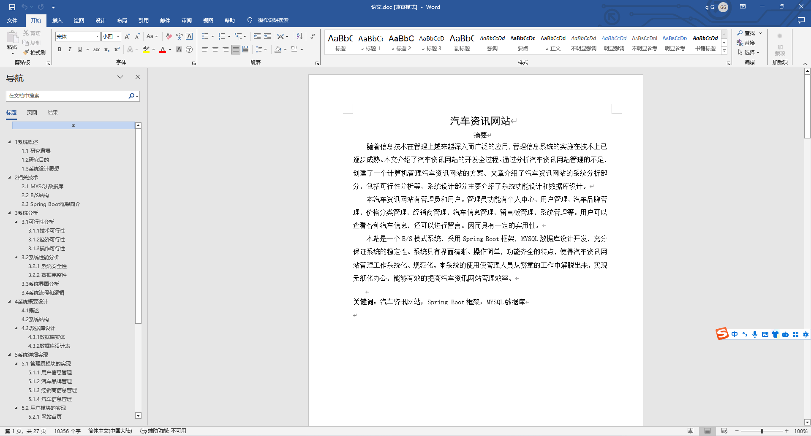
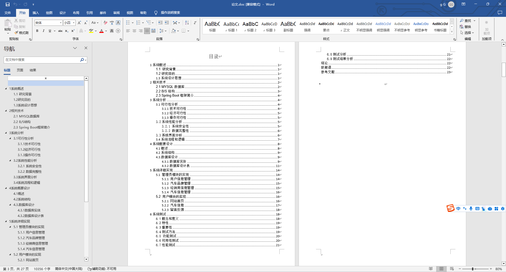

### 程序截图：
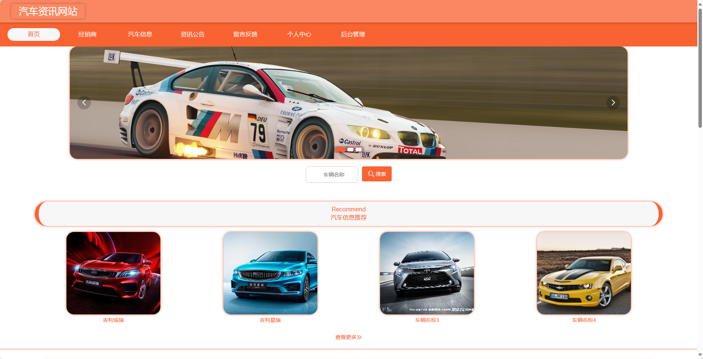
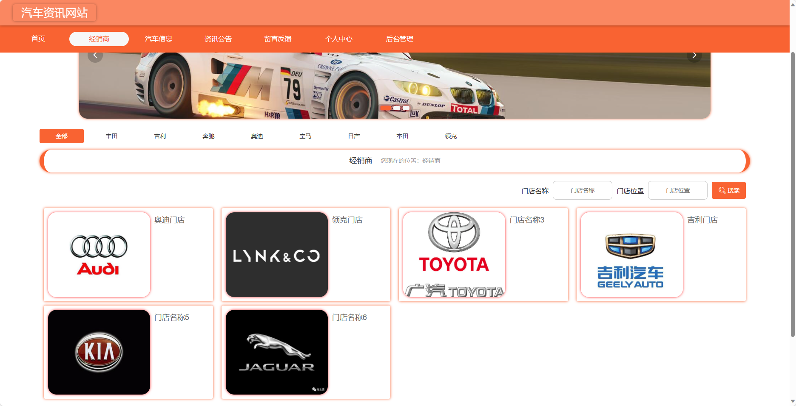
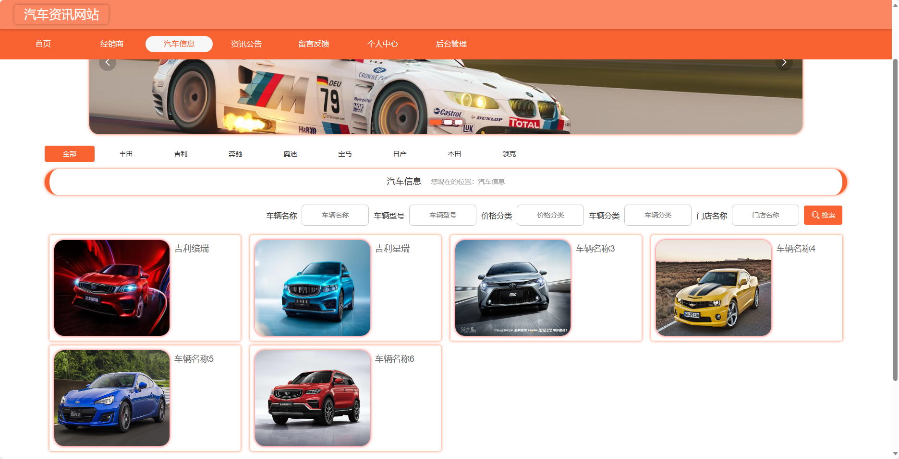
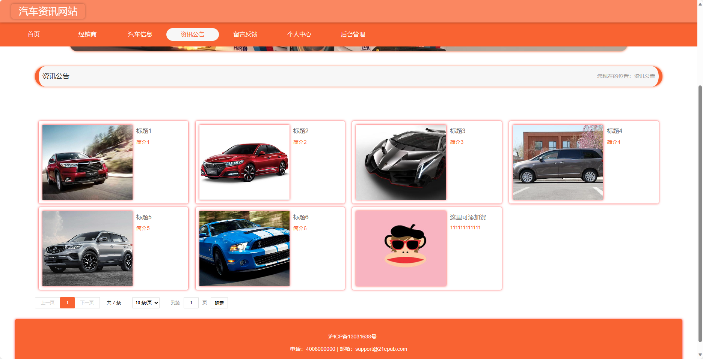
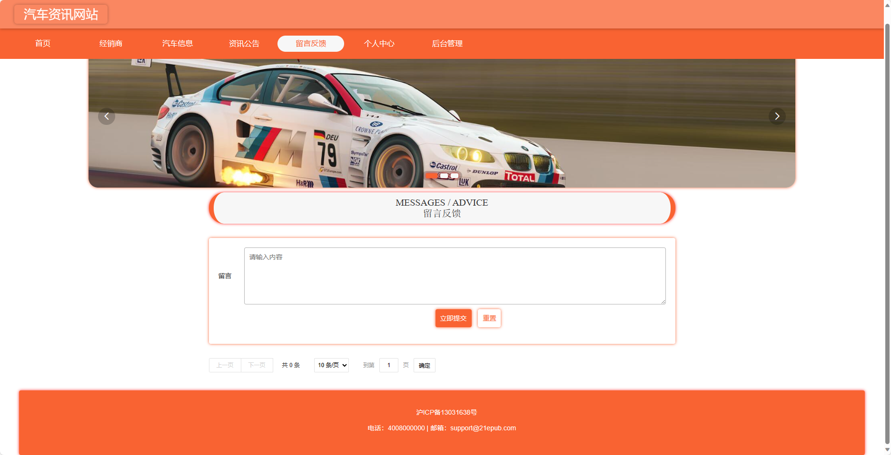
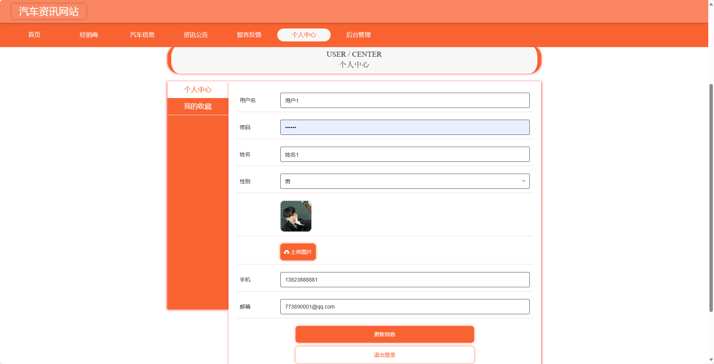
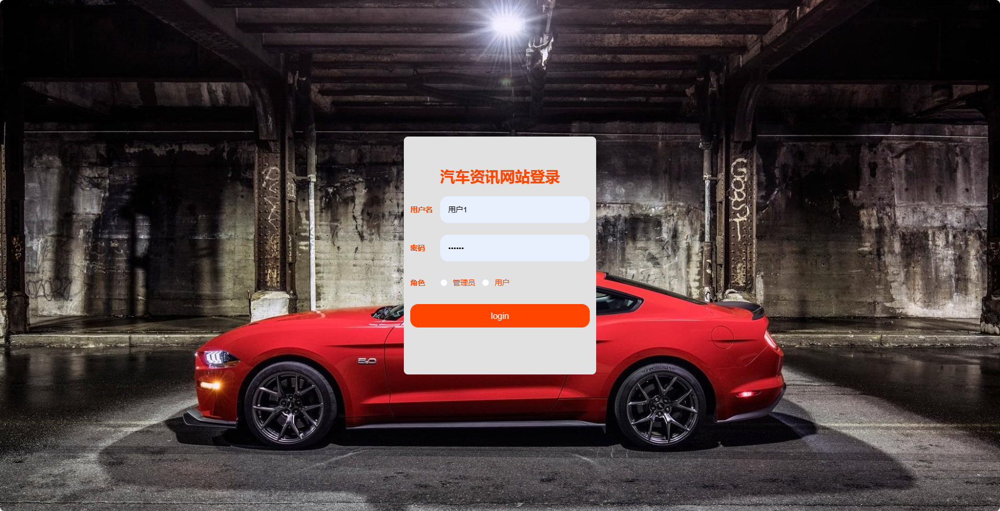
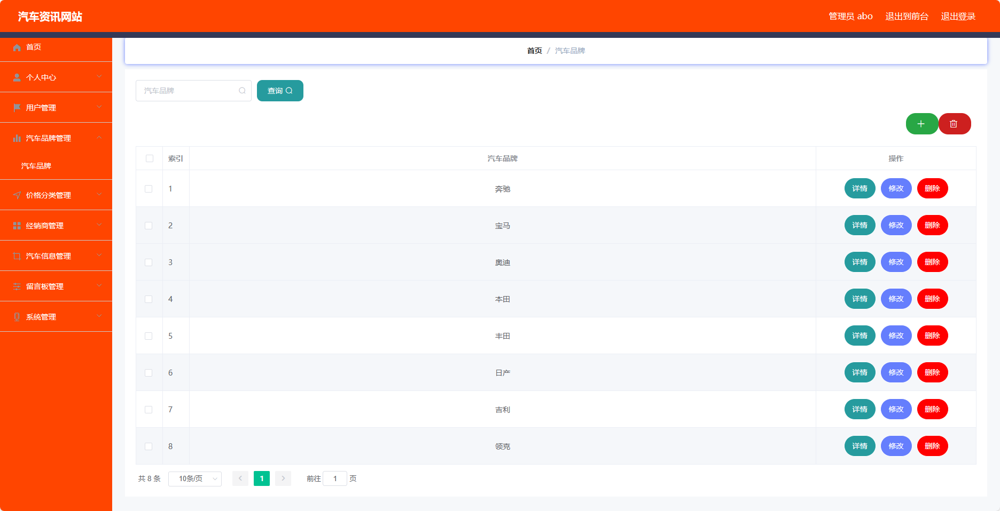
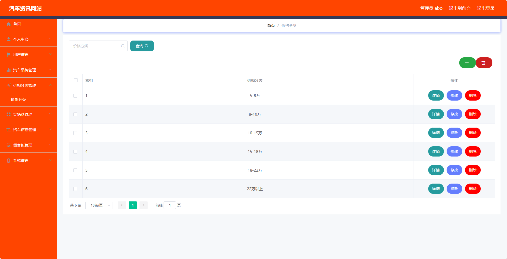
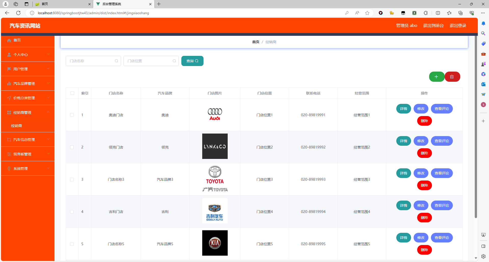

